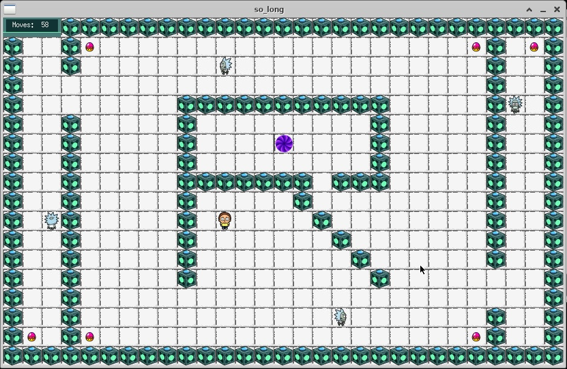

# 42-so_long

Trata-se de um projeto básico de computação gráfica, especificamente um jogo 2D. 
O objetivo proposto foi o de melhorar as habilidades nas seguintes áreas: gerenciamento 
de janelas, manipulação de eventos, cores, texturas e assim por diante.  
Para executar esse projeto foi usado entre outros recursos a biblioteca gráfica da escola 42: 
a MiniLibX.  Esta biblioteca foi desenvolvido internamente e inclui ferramentas básicas 
necessárias para abrir uma janela, criar imagens, lidar com eventos de teclado e mouse, 
entre outras coisas.

Logado ao workspace da 42, com o tightVNC instalado, execute `make bonus` para iniciar o projeto, na sequência  `./so_long_bonus ./maps/rick_world.ber` para dar start no game. Baseado no desenho animado Rick and Morty, o personagem principal a ser controlado é o garoto Morty. Pegue os coletáveis (ovos vermelhos) na tela, após realizar tal ação o portal roxo se tornará verde sendo assim a saída rumo a vitória. Cuidado com os Ricks robóticos andando pela tela, ao ser tocado por algum deles o jogo acaba! 
